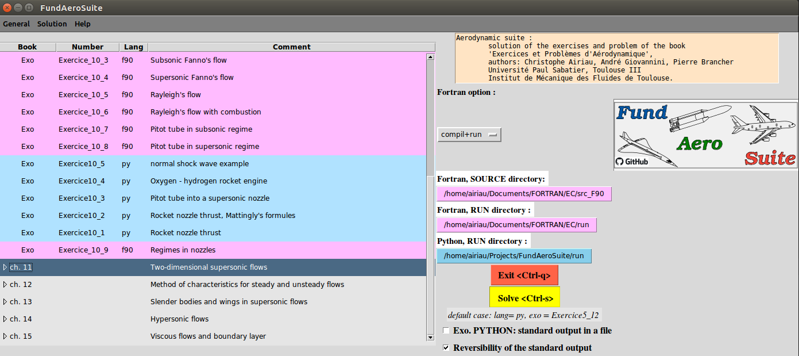
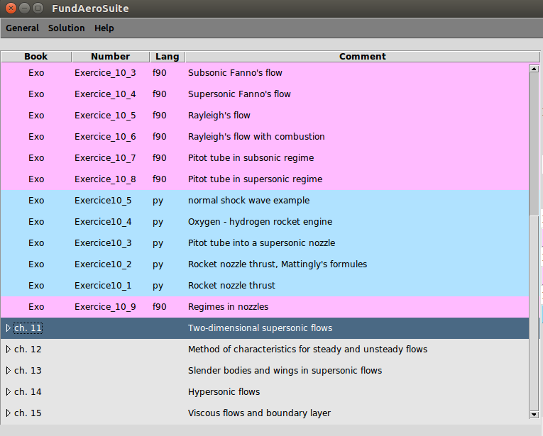
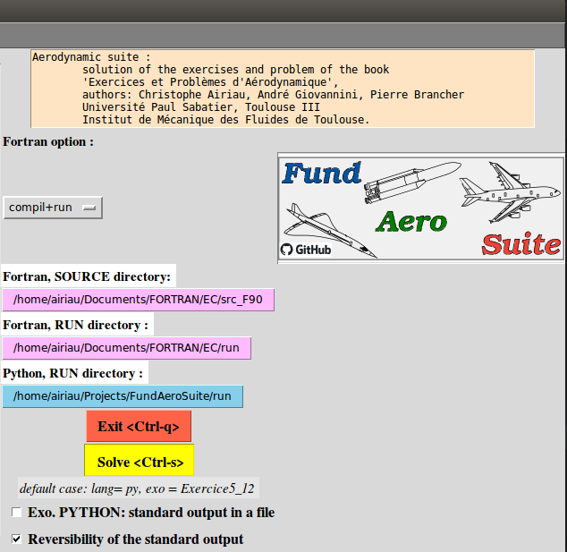

.. _sec_tuto:

=============
Tutorial
=============

To run a python script at least two ways are possible:

#. to instal a Python Developpement Environnement as `spyder <https://www.spyder-ide.org/>` 
#. to run the python script into a bash terminal

* Three versions of the main script and a bash shell script have been developed.
* Some commands uses a shell terminal, which is available in linux system
* Shell terminal can be easily installed in window 10 if necessary. I recommend it.
* Shell terminal are provided with gvim, sublime text, VSC, pycharm, spyder3, etc ... (in any platform).

Using :py:mod:`main.py`
#######################

Run the script
**************

The approach  requires to know python, and to know how to find the reference of the exercise whose solution is desired.
The script is named :py:mod:`main.py`.
For instance in a terminal one can write :

.. code-block:: bash

	python3 main.py > outputs.txt 

or more simpler : 	

.. code-block:: bash

	python3 main.py 

Before the user has to find and select which exerercises have to be solved.

Choose the exercises
*********************

Open the main script file :

1. Python solutions:
  
* set 

  .. code-block:: python
  
    src="python"
    
* define the list of exercises to solve :  
  
  - a **single exercise** : solution( ( (chap_number, (exercice_number, ) ), ) ) 
    
    .. code-block:: python
    
      solution(( (10,(5,)),))   # exercise 10,  chapter 5
  
  - **several exercises, several chapters**, write a list as 
    
    .. code-block:: python
    
        solution(( (8, (6, 7)) , (9, (1, 2)) ))

2. Fortran solutions:

* set 

  .. code-block:: python
  
    src="fortran"

* define the task with the task index 
  
  0. "liste"  : exercise list with fortran coding
  1. "compilation" : to compile the source code
  2. "run" : to run the source code
  3. "compil+run" : make the both
  
  .. code-block:: python
  
      task=(3)
  
* select the exercise reference into a list, similarly to python:

  .. code-block:: python
  
    choice = ( (10, (1, 2)), (11,(2,)), )
        
* Fortran tasks are not currently implemented with Windows. But it can be perfomed manually in the Fortran source directory.
* the Fortran source and run directory path must be implemented into the file :py:mod:`default_path`
* the list of exercises solved in Fortran can be found in :py:func:`Book.Fortran.fortran.liste_exo_fortran`

.. warning::

	It is adviced to solve a single exercice, since you can have many plot figures.

Using :py:mod:`main_with_args.py`
#################################

It works to solve a single exercise. Run another time to change exercise.

Run the script
**************

In a shell terminal enter : 
  .. code-block:: bash

	python3 main_with_args.py -c x -e y -l z  

where :

* x is the chapter number
* y is the exercise number
* z is the language of the exercise : 

  - p for Python
  - f for Fortran

The default option is for Python exercise (z=p).

Using a bash shell script `x1.run.sh`
#####################################

* This script makes the same thing as the previous one, but using bash shell.

In a shell terminal enter : 
  .. code-block:: bash

    ./x1.run.sh -c x -e y -l z

where :

* x is the chapter number
* y is the exercise number
* z is the language of the exercise : 

  - p for Python
  - f for Fortran

The default option is for Python exercise (z=p).

* Shell script must be render executable with `chmod a+x` command and an help is implemented in case of bad inputs.
* A nicer script could be a wrapper for :py:mod:`main_with_args.py`  with the script  written as :
  
  .. code-block:: bash

    #!/bin/bash
    echo "run main_with_args with bash shell"
    python3 main_with_args.py -c $2 -e $4 -l $6 

* It can be secured by testing the number of arguments and an help could be provided.*

Using the GUI  :py:mod:`run_gui.py`
###################################

Run the script
**************

In a terminal one can write :

.. code-block:: bash

	python3 run_gui.py  

A **Graphical User Interface** has been developped with the **tkinter module** to solve exercises by a mouse selection on a window.

The user has to run the main script :py:mod:`run_gui.py`:

* The GUI seems to work with linux, but with bad font definitions : a problem of font management with *tkinter module* in linux (`.config/fontconfig/fonts.conf` related to truetype font).
* The GUI can be run with ``spyder3`` with nice fonts. But when quitting the programm, there are some undefined problems in linux.
* Some behaviours can be different with Windows 10.
* Many parameters of the GUI may be changed in :py:mod:`run_gui.py`:
* Problems can also depends on the Python module installation

.. seealso::

	It is always possible to work with the main scripts :py:mod:`main` or :py:mod:`main_with_args`

When GUI is activated, a window is opened as in the figure below

We can find 
* a left part where the exercise is choosen
* a right part where options and buttons are displayed
* a menu, which is not necessary actually 

Select an exercise
*******************

The exercise is select from the  left part, using the mouse, as it is zoomed below:

* A color code may visualized fastly the type of source code, in Python or Fortran. 
* A comment indicated the content of the exercise.

Set the options before solving
******************************

Details are given in the figure below:

For Python
-----------
The option is about the standard ouput.

When running the Python source, the standart output is the terminal normally used.

It is possible to save the results into a file which will be written in the "Run" directory,
indicated in the :py:mod:`default_path.py` file.

It is possible to keep the reversibiliy (or not)  of the standard out towards a file and coming back,
when selecting the output in a file (ckeck box).

For Fortran
------------

* The default Fortran path are given in the  :py:mod:`default_path.py` file. But it is possible to change it by selection with the mouse.
* Three options are found :

  1. compilation of the source
  2. run the executable 
  3. compil and run the executable

Most of the time option 3 is used. 

Solve an exercise
******************
There are tree possible ways:

1. push the solve button on the right part
2. use the keyboard with Control + s 
3. use the menu named "Solution"

See the solution
*****************

* The solution with Python is displayed in the main terminal. In case of outputs written in a file, it is possible using the menu "Solution" to select and display this file, found the Python run directory

* The solution with Fortran are always in an output file, and using the menu "Solution" is the  only way to see the results

* The files containing solutions can always be opened by any text editor, in the run directory.

Quit the GUI
*************

There are four possible ways to close the GUI:

1. push the Exit button on the right part
2. use the keyboard with Control + q 
3. use the menu named "General"
4. close the main window

In some unexplained conditions on **windows 10**, it can occur that the main window does not want to close (tkinter bug or error of programming ?)
The window must be killed by closing the Python IDE. Then it is adviced to run the solution inside a terminal
or without the GUI. 

Modifying a python exercices
############################

The exercises are refered in the :py:func:`Book.Correction` module with the name given in table :ref:`list_exo_python_table` as

``Exercice_#_*`` where # is the chapter number and * is the exercise number.

* The exercise always begins by a section where parameters are defined and can be modified.

* Some functions used by the exercise can be found before or inside the exercise function. 

* Some classes sometimes used are available in the same directory.

Adding a python exercise
#########################

#. Just write a new exercise in the same chapter file
#. Create a new a new specific file or class or module.
#. Do not forget to add the new exercise name in the :py:func:`Book.Correction` module or in the GUI main file. A new exercise, should be simply included in the documentation by doing in a shell terminal (linux):

.. code-block:: bash

    # go to the docs directory (depending of its location)
    cd docs/
    ./x3.prepare_doc.sh   # it must be executable
    make clean
    make html

#. To add the new exercise in the list of exercises, modify the file `docs/source/table/liste_python_en.csv`

Modifying Fortran exercise
###########################

The source files must be in the ``Fortran/EC/src_F90/`` directory

#. Juste write a new exercise in the corresponding chapter file
#. Create  a new file or new subroutine or module and add it in the module ``Fortran/EC/src_F90/mod_Etude.f90``, in   ``subroutine liste_exercices``